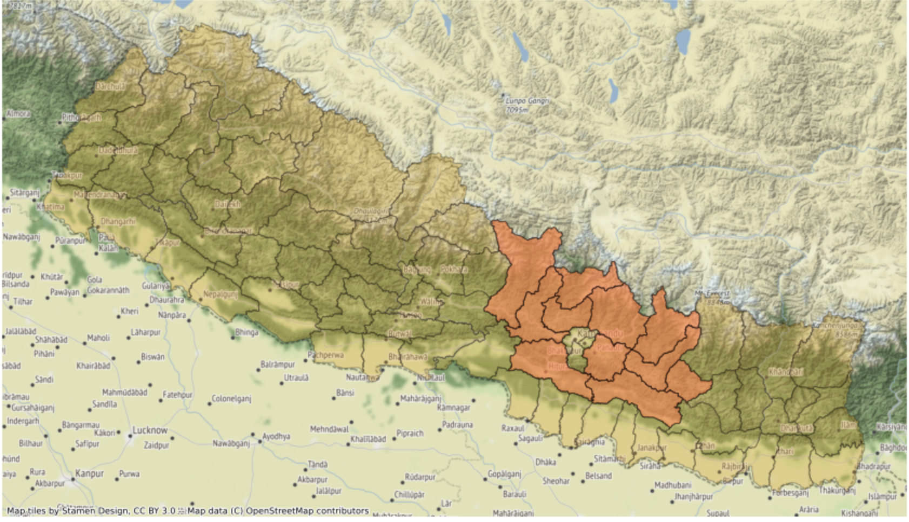
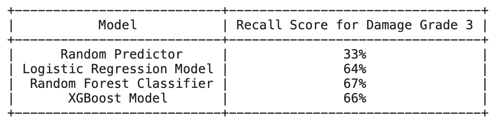

# Modeling Earthquake Damage

### Setup Instructions

Please ensure that you have installed [Anaconda](https://docs.anaconda.com/anaconda/install/) before proceeding to install the environment

#### `nepal-env` conda Environment

This project relies on you using the [`environment.yml`](environment.yml) file to recreate the `nepal-env` conda environment. To do so, please run the following commands *in your terminal*:

```bash
# create the nepal-env conda environment
conda env create -f environment.yml

# activate the nepal-env conda environment
conda activate nepal-env

# if needed, make nepal-env available to you as a kernel in jupyter
python -m ipykernel install --user --name nepal-env --display-name "Python 3 (nepal-env)"
```

### Data Download

To download the relevant data, run the bash command found in [this jupyter notebook.](./notebooks/exploratory/get_data_scripts.ipynb)

This will retrieve the data from [Nepal Earthquake Open Data Portal](https://eq2015.npc.gov.np/#/download) and move the required files to the data folder within this repository


### Repository Navigation
```
├── data        
│   └── csvs                         <- data files downloaded from website
│
├── notebooks          
│   │                    
│   └── exploratory                  <- raw, work-in-progress jupyter notebooks
│   └── report                       <- final analysis summary notebook
│
├── refrerences         
│   └── data_dictionary              <- reference file
│
│
├── report        
│   │                    
│   └── figures                      <- visualizations saved from EDA and modeling
│   └── slides.pdf                   <- presentation slides in pdf format
│
├── src                              <- source code for use in this project
    ├── cleaning_functions.py        <- data cleaning scripts
    └── modeling_functions.py        <- modeling scripts
    └── preprocessing_functions.py   <- data preprocessing scripts

```


 ### Project Overview
This project attempts to predict building reactions to earthquakes by making a model that predicts the degree of damage that can be caused to building structures as a function of earthquakes’ intensity and the building parameters.

We analyse data collected from a survey carried out by the government of Nepal after the 2015 earthquake from 11 districts in Nepal that were most affected by the earthquake of magnitude 7.8 Mw on April 25th 2015. The aftershocks from this earthquake were felt through April 26th and a 'major' aftershock of 7.3 Mw was obsrved on May 12th, 2015.<sup>1</sup>  

The goal is to build a predictive model that can help classify buildings into 3 classes of damage grade they fall under, based on their composition and past performance of similar buildings during an earthquake. This will help government agencies, architects, insurers and people at large to identify the damage grade their buildings correspond to. This analysis and obtained model can be helpful for formulating reconstruction design codes and regulations to increase resilience of buildings in the region of Nepal. The current model includes some of the important factors affecting the health of any structure, namely- age, number of stories, floor areas, foundation types and building materials. The method of damage prediction is based on an earthquake with an intensity of 7.8 Mw to 7.3 Mw and buildings with different damage levels. 

coral highlighted regions are the 11 districts from where the data was collected. The epicenters of both the earthquake and the major after shock were within these regions

 ### Preview of Results



- Top predictive model was identified to be a Random Forest Classification Model
- The model was able to predict class 3 (building belonging to damage grade 3 requiring reconstruction) with a recall rate of 67%
- The model showed very low variance based on its performance on train, validation and test data, which gives confidence in its generalizability.

[link for presentation slides](./report/presentation_slides.pdf)
 
### Project Methodology

The overal all approach towards this project was the Cross-Industry Standard Process of Data Mining Model: Business Understanding, Data Understanding, Data Preparation, Modeling and Evaluation. 

#### Business Understanding
The business requirement of this project is to analyze the various building parameters in the region of Nepal to ascertain their relationship with the potential vulnerability of the buildings. Past data is analyzed so as to be able to predict damage grades to whcih the buildings belong to. Such predictions and analyses can be useful to architects, investors, insurers and public at large. 

#### Data Understanding
The data was collected through survey by the Central Bureau of Statistics that works under the National Planning Commission Secretariat of Nepal. The survey is one of the largest post-disaster datasets ever collected, containing valuable information on earthquake impacts, household conditions, and socio-economic-demographic statistics.

The dataset mainly consists of information on the buildings' structure and their legal ownership. Each row in the dataset represents a specific building in the region that was hit by the Nepal earthquake of 2015. There were a total of 762106 datapoints.

The target is identified to be an ordinal variable with 3 classes (Damage Grades):
- `Damage Grade 1`: Relates to hairline or thin cracks in plaster on a few walls, damage to non structural parts like chimney, projecting cornices. Only architectural repairs needed. The load carrying capacity of the building is not reduced appreciably.
- `Damage Grade 2`: Refers to large or extensive cracks in most walls, collapse of small portion of non load-bearing walls. Load carrying capacity of structure is partially reduced and significant structural repairs are required.
- `Damage Grade 3`: Relates to total or near collapse of the buildings. Large gaps occur in walls, walls collapse, partial structural failure of floor/roof requiring reconstruction.<sup>2</sup>

The feature set mainly comprises of categorical values, most of which describe the parameters of the building with regards to its foundation type, roof type, composition of superstructures, main structure, ownership information and layout of the building. There are three columns that relate to the location of the building - district, municipality and ward ids (from largest to most specific subregion)


#### Data Preparation

- The raw data was first analyzed to see various unique values for all the features. Some duplicate columns were removed that were offering the same information - `condition_post_earthquake`, and `technical_solution_proposed` were dropped and `damage_grade` was retained with sub classification based on `technical_solution_proposed`
- Data cleaning steps were performed to remove nans, clean text, and combine the ownership and structure dataframes.

##### Preprocessing Steps were performed as follows:

- Train - Test split the data setting test size to 20%
    - this gives a train size of 609674 datapoints and a test size of 152419 datapoints
- Train - Validation split the training data next with validation size set to 25%
    - this gives a train size of 457255 datapoints and a validation size of 152419 datapoints
- Resample the training data using stratified sampling technique from *imblearn.under_sampling* *RandomUnderSampler* which will help in balancing the class imbalance in training data. (this is done instead of using SMOTE since there are enough datapoints to work with)
    - this gives 245571 datapoints in the final training data
- One Hot Encode all the categorical features in the training data and use the derived encoders of each feature to transform the respective categorical features in the validation and test sets
- Standardize the numeric features of the datasets using *StandardScaler* object from *sklearn.preprocessing*

#### Modeling
The Metric for Model Evaluation is established first

#### Metric - Recall Score

\begin{align}
##### Recall Score for Class 3 = \frac{True Positives for Class 3}{True Positives for Class 3  +  All False Negatives for Class 3}
\end{align}

Modeling iterations were carried out for Logistic Regression, Random Forest Classifier, and Gradient Boosting Classifier Xgboost 
### Modeling Steps:
- First a Vanilla model with cross validation was run to get an estimate of model performance across cross validation folds.
- Then the Vanilla Model was fit on training data and recall scores were generated for both training and validation data using the fitted model.
- Grid search was performed on downsampled training data for each model to help guide hyperparameter tuning.
- Using the best params identified from grid search new models were built by fitting on the train data. 
- Performance of the model was evaluated between the train and validation set.
- Further model iterations were performed to improve the recall score (since the grid search was limited by the choice of grid and downsampled data)
- Best performers of each classification models were picked and predictions were made using the test data

Based on Recall Score for Class 3, the Metric for evaluating model performance, Random Forest Classifer Model performed better than the other classifiers with a recall score of 67%

The hyperparameters for the chosen model were:
- max_depth=12
- max_features='sqrt'
- n_estimators=150

#### Conclusion:

This project set out to discover a predictive model that would correctly classify buildings in the region of Nepal based on their potential vulnerability to earthquakes. The model studied the past behaviour of the buildings in the region to be able to predict future failures. The analysis and model found Random Forest Classifer with 150 estimators and max tree depth of 12 to be the best performer that maximized recall score for Class 3 at 67%. The overall performance of the model is at an accuracy of 64%. Important building parameters were identified using the best performing model.
- The top features that increase the probability of a building to be classified as class 3 were identified to be:
    - buildings having super structure made of mud, mortar or stone
    - foundation of mud, mortar, stone or brick
    - buildings in the district of Sindhupalchok (district id 23)
- The top features that increase the probability of a building being classified as belonging to class 1 (requiring no major repairs) were:
    - Ground floor of buildings made with reinforced concrete
    - buildings in the region of Makwanpur (district id 31) and Okhaldhunga (district id 12)

### Future Investigations:

- From the identified important features from the current model further investigation can be conducted to establish relationship between the building features and the varrying damage grades. 
- Can a black box model such as a Neural Net give us better predictions for 3 classes?
- Can an app be built that takes in parameters of buildings in the region of Nepal and gives predictions regarding their potential vulnerability (damage grade)


### Citations

<sup>1</sup> Wikipedia “April 2015 Nepal earthquake” Available at:https://en.wikipedia.org/wiki/April_2015_Nepal_earthquake

<sup>2</sup> Open Data Portal "2015 Nepal Earthquake " Available at: https://eq2015.npc.gov.np/#/faqs/faqs?id=what-would-be-the-best-general-proxy-for-overall-building-damage

General idea for the project credit: Driven Data "Richter's Predictor: Modeling Earthquake Damage" Available at: https://www.drivendata.org/competitions/57/nepal-earthquake/page/136/

